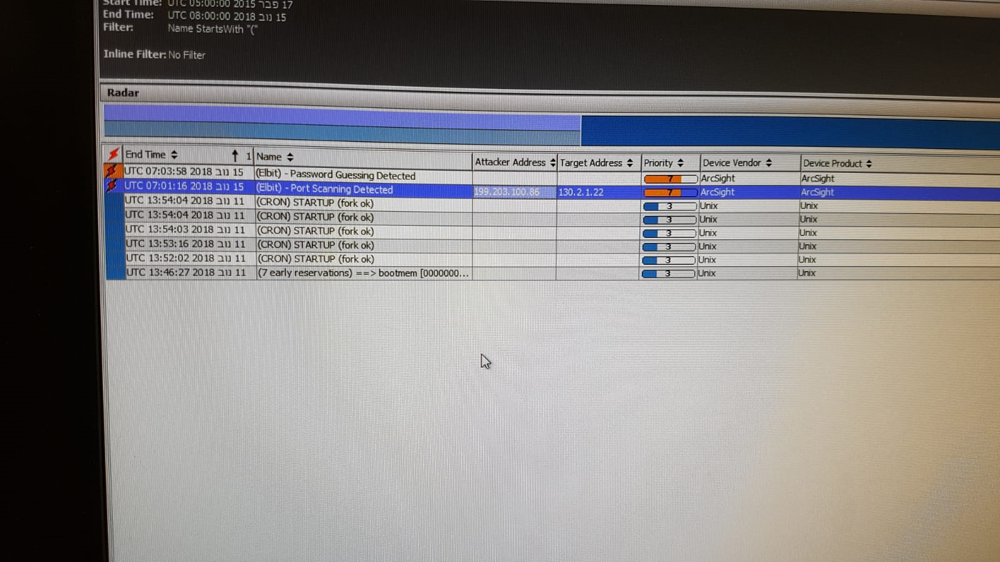
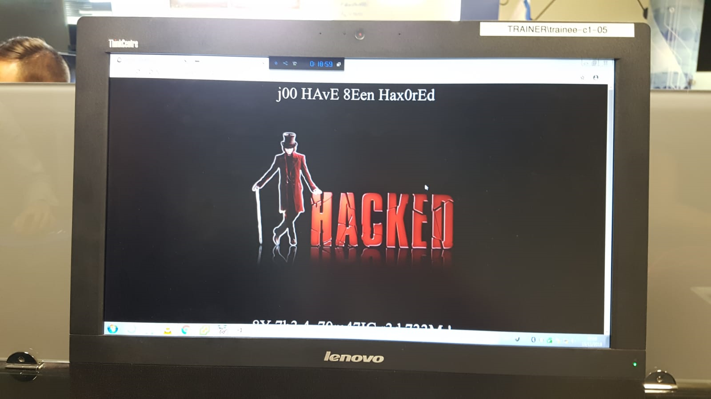
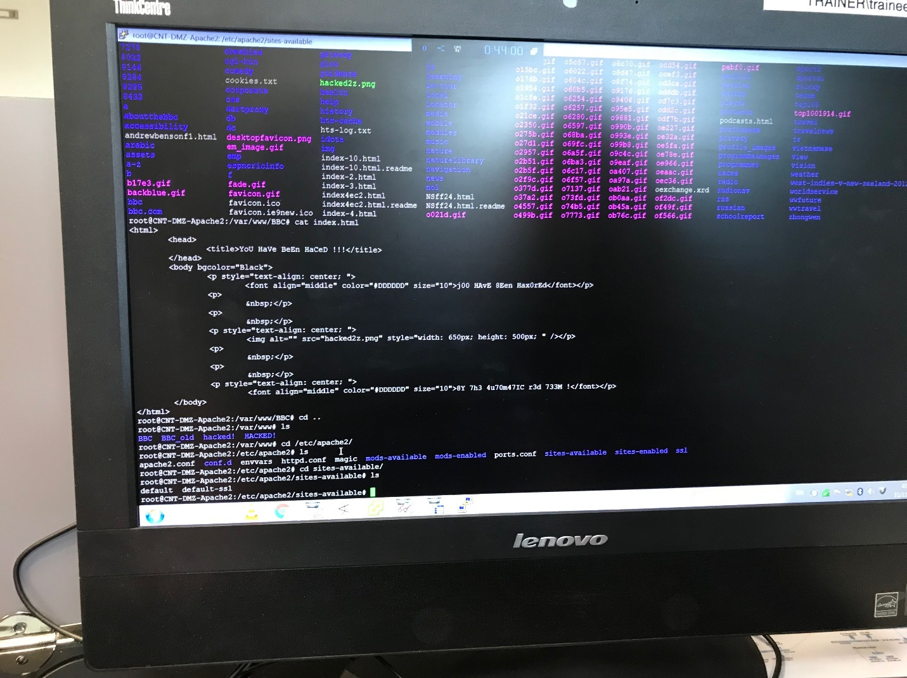
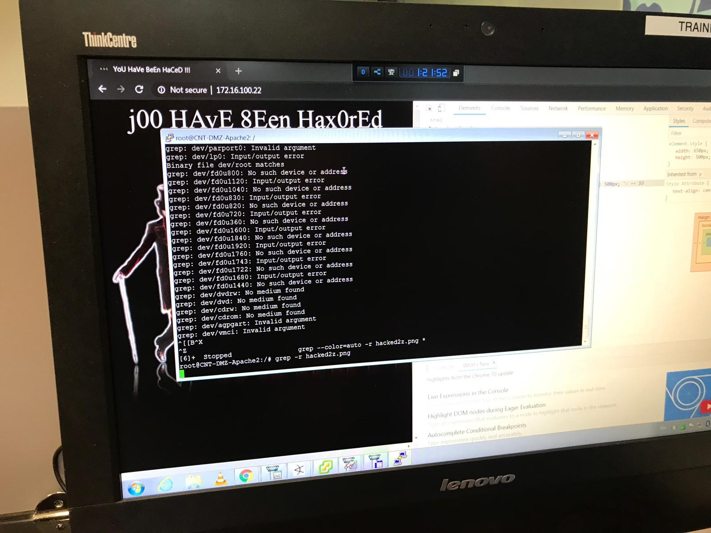
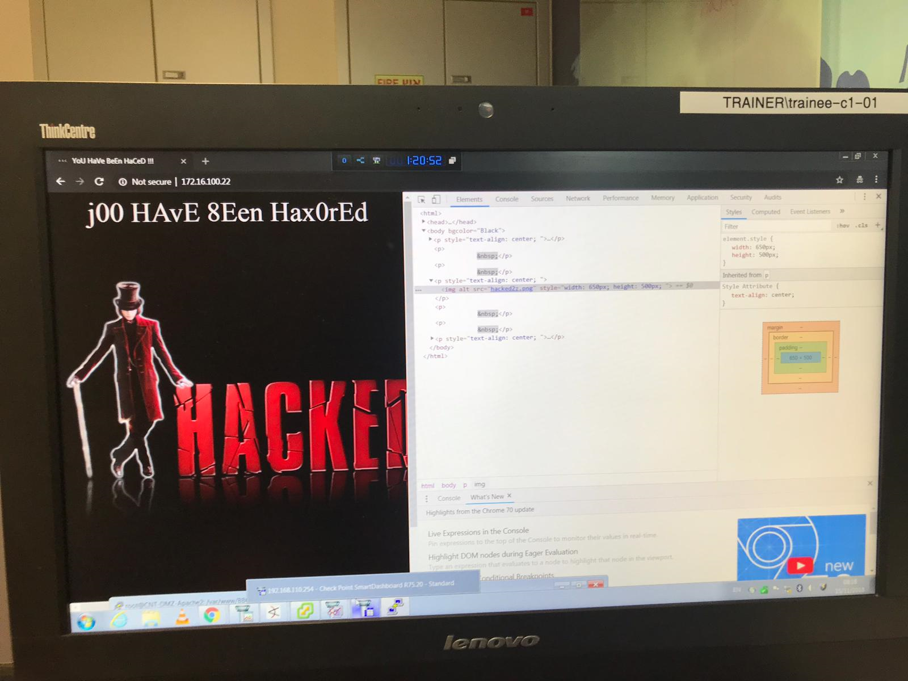
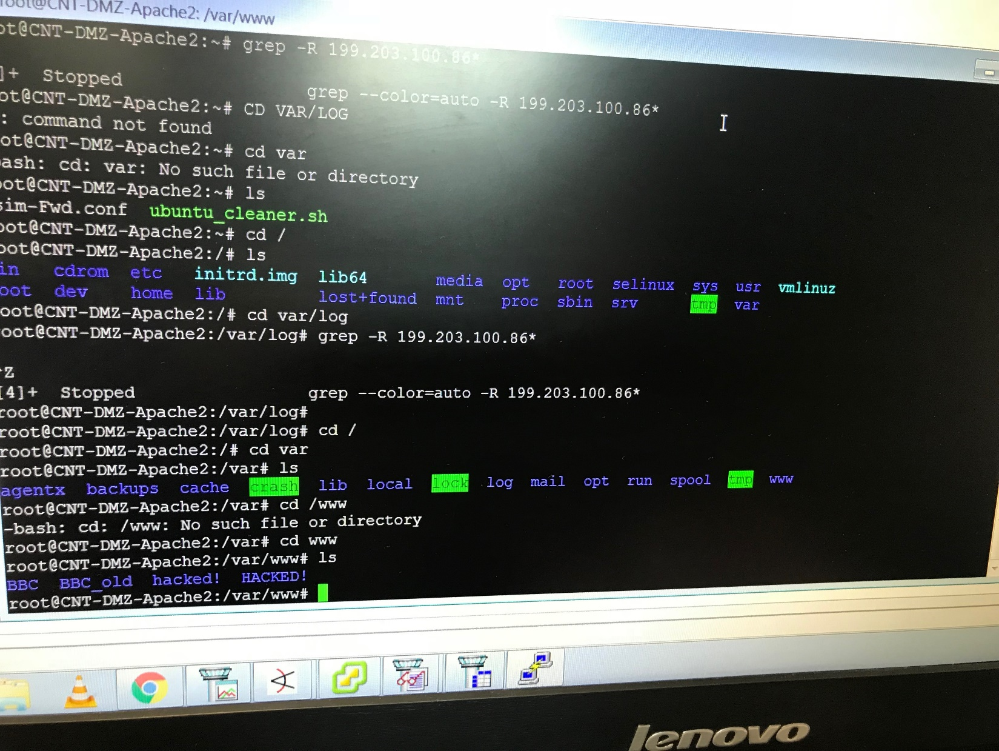
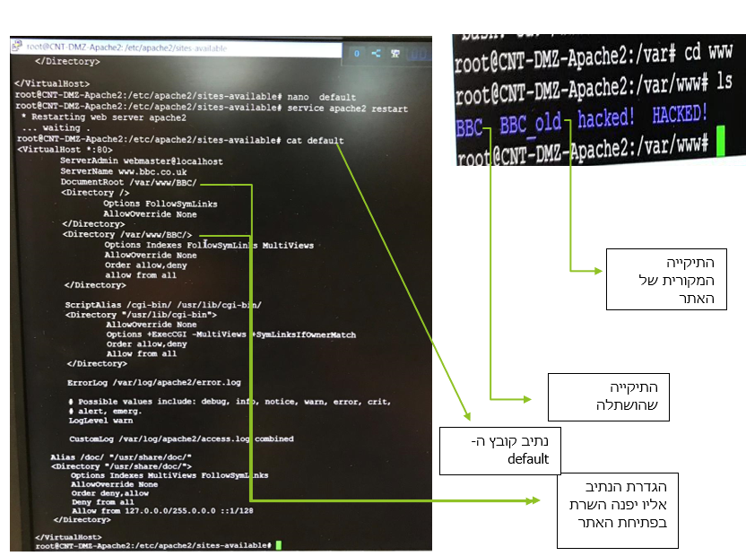
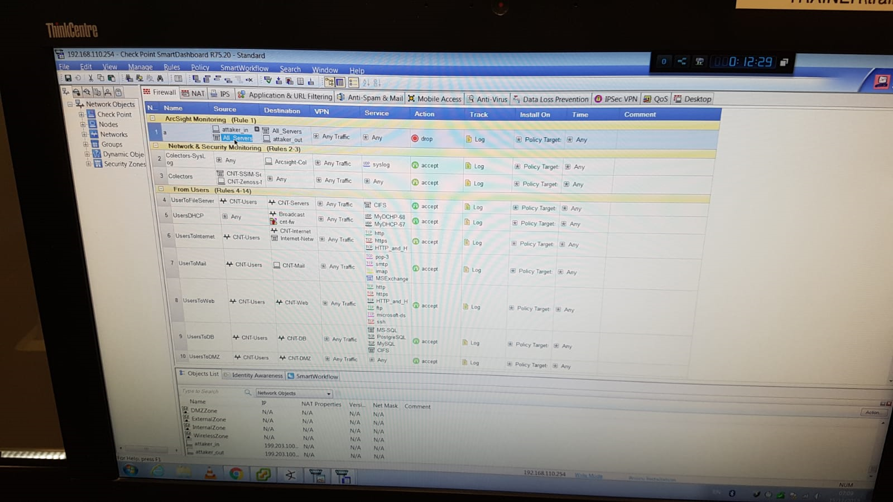
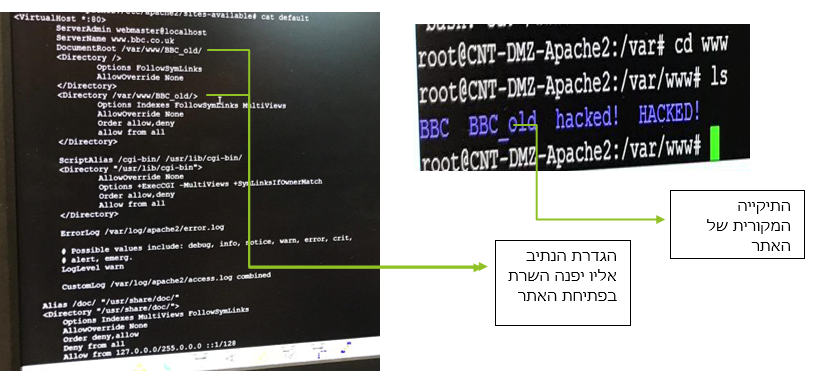

#דו"ח מעבדה- תרחיש מס' _02_
###פרטים:		
###מגיש: ברק שרעבי
###תאריך: 15/11/18
#שם התרחיש:Web Defacement

###תהליך ההתקפה:
```
תהליך ההתקפה התבצע באמצעות Port-Scanning 
התוקף ביצע סריקה לכל הפורטים הקיימים ולכל אחד מהם שלח בקשה לבדיקה האם יקבל איזשהו תשובה, 
בכך התוקף הצליח למצוא פרצה לאחד מן הפורטים שהוא פורט הSSH (22) ומצא "אוזן קשבת"
לאחר מכן הפורץ עשה Brute Force לROOT  ובכך הסיסמא נפרצה והצליח לגשת לשרת.
לאחר הפריצה ה"האקר" ביצע שינוי\הוספה בתיקיה הנמצאת בנתיב  (var/www/html) נתיב זה מאחסן את התיקייה ובה נמצאים קובצי הindex  של אתר האינטרנט שלנו ושם הוסיף תיקיה חדשה בשם (BBC)המאחסנת קבצי Index  שהתוקף יצר.
לאחר מכן האקר ניגש לנתיב (etc\apache2\site-available) לתוך קובץ בשם default קובץ זה אחראי על נתיב הindex  שיפתח בעת העלאת האתר ושם שינה את הנתיב מהתיקייה של האתר שלנו לתיקיה של הקבצים שהוא השתיל והתוצאה הייתה מתקפת Web Defacement.
```

###תהליך הזיהוי:
```
תהליך הזיהוי הראשוני התבצע באמצעות תוכנת ה- ArcSight שיודעת לנתח לוגים מכמות גדולה של שרתים ובהתאם לחוקים שהוגדרו מתריע על חריגות.
ה- ArcSight התריע על שני מקרים 
```
 
```
1.	Port-scanning
2.	Password guessing detected
בשעה 7:01 UTC  לערך התראה ראשונית התקבלה בתוכנה והתריעה על כתובת IP 199.203.100.86 המנסה לגשת ל - 130.2.1.22 שזוהי כתובת IP של שרת אפצ'י האחראי על אתר BBS.
לאחר מכן ניסיון גישה לאתר הראה כי האקר הצליח לגשת לשרת ולהשתיל קבצים.
```
 
 


```
ניגשנו לשרת Apache  וביצענו סריקת רקורסיבית אחר IP של התוקף ובנוסף חיפשנו את אחד מן המאפיינים שהושתלו שזהו התמונה שהאתר העלאה והממצאים הראו כי האקר ביצע שינוי בתיקיית הhtml  שלנו.
```
 
 
 
```
לאחר גישה לתיקייה אבחנו בתיקייה חדשה שהושתלה בנוסף לתיקיה המקורית של האתר ששם נמצאים כל הקבצים המקורים של האתר.
ובנוסף ניגשנו לשירות Apache2  שירות האחראי להעלאתו של האתר ובדקנו את קובץ המיפוי default  לראות לאיזה נתיב הוא מפנה.
הממצאים הראו כי הנתיב שונה לתיקייה החדשה שהושתלה ושם נגמר התרחיש.
```
 


###תהליך הגנה:
```
תהליך ההגנה התבצע באמצעות חקיקת 2 חוקים חדשים למניעת תקשורת בין "האקר" לשרת הארגון ובין השרת "להאקר" 
```
 
```
זאת עושים באמצעות תוכנת  Smart view Tracker  של חברת צ'ק פוינט.
חוק ראשון שנחקק הוא אי מתן גישה לכתובת הIP  לתוך הארגון.
חוק שני שנחקק חסימת כל היציאות של השרתים לתקשורת עם התוקף.
לאחר מכן ניגשנו לשירות Apache2  לקובץ ה-default וביצענו שינוי מנתיב התיקייה שהאקר שינה לנתיב התיקייה המקורית של הארגון.
```
 
```
את התיקייה של האקר שמרנו במקום אחר לשם חקירה נוספת למניעת "הפתעות"
```
###תהליך הגנה מונעת:
```
•	חסימת גישה ב SSH (22) מחוץ לארגון.
•	הרשאות גישה לצוות הארגון בלבד
•	חסימת משתמש לאחר מספר ניסיונות
•	מתן הרשאות לתיקיות מערכת לעובדי הארגון בלבד
•	קביעת מדיניות לחוזק סיסמא 
```
###הפרצות באבטחת הארגון
```
פורט  ) SSH22 (שהייה פתוח ואפשר לתוקף גישה לשרת וביצוע Brute Force לROOT  
•	גישה ב SSH (22) מחוץ לארגון.
•	אי חסימת משתמש לאחר מספר ניסיונות
•	מדיניות סיסמא חלשה בארגון
```
###אופן עבודת הצוות
```
לאחר התרחיש הראשון הצוות הצליח לשתף פעולה למיגור התקיפה וזאת בשל אימון, ניסיון והכרות חלקית עם התוכנות השונות.
על הצוות להמשיך וללמוד לעבוד בשיתוף פעולה יחד עם מתפעל האירוע וכמובן לצבור ניסיון וידע בתוכנות השונות על מנת לעצור את התקיפה הבאה.
וזאת באמצעות קריאה ולמידה מורחבת על התקיפות השונות ואופן השימוש בשרת ופקודותיו.
הצעות ייעול – על הצוות לעבוד בשיתוף פעולה וחלוקת תפקידים כדי לייעל את תהליך ההגנה. 
```
###חוסרים/קשיים
```
הקשיים הבולטים באירוע מסוג זה הוא חוסר היכרות עם מצבים אלו, סנכרון בין כל עובדי הארגון ובעיקר חוסר ניסיון וידע בתפעול אירועים מסוג זה.
```
